<!-- markdownlint-capture -->
<!-- markdownlint-disable -->

# Code Metrics

This file is dynamically maintained by a bot, *please do not* edit this by hand. It represents various [code metrics](https://aka.ms/dotnet/code-metrics), such as cyclomatic complexity, maintainability index, and so on.

<div id='myjetwallet-connector-b2c2'></div>

## MyJetWallet.Connector.B2C2 :warning:

The *MyJetWallet.Connector.B2C2.csproj* project file contains:

- 8 namespaces.
- 24 named types.
- 621 total lines of source code.
- Approximately 224 lines of executable code.
- The highest cyclomatic complexity is 8 :warning:.

<details>
<summary>
  <strong id="myjetwallet-connector-b2c2-rest-enums">
    MyJetWallet.Connector.B2C2.Rest.Enums :heavy_check_mark:
  </strong>
</summary>
<br>

The `MyJetWallet.Connector.B2C2.Rest.Enums` namespace contains 1 named types.

- 1 named types.
- 7 total lines of source code.
- Approximately 0 lines of executable code.
- The highest cyclomatic complexity is 0 :heavy_check_mark:.

<details>
<summary>
  <strong id="orderside">
    OrderSide :heavy_check_mark:
  </strong>
</summary>
<br>

- The `OrderSide` contains 2 members.
- 5 total lines of source code.
- Approximately 0 lines of executable code.
- The highest cyclomatic complexity is 0 :heavy_check_mark:.

| Member kind | Line number | Maintainability index | Cyclomatic complexity | Depth of inheritance | Class coupling | Lines of source / executable code |
| :-: | :-: | :-: | :-: | :-: | :-: | :-: |
| Field | <a href='https://github.com/MyJetWallet/MyJetWallet.Connector.B2C2/blob/master/src/MyJetWallet.Connector.B2C2/Rest/Enums/OrderSide.cs#L5' title='OrderSide.buy'>5</a> | 100 | 0 :heavy_check_mark: | 0 | 0 | 1 / 0 |
| Field | <a href='https://github.com/MyJetWallet/MyJetWallet.Connector.B2C2/blob/master/src/MyJetWallet.Connector.B2C2/Rest/Enums/OrderSide.cs#L6' title='OrderSide.sell'>6</a> | 100 | 0 :heavy_check_mark: | 0 | 0 | 1 / 0 |

<a href="#OrderSide-class-diagram">:link: to `OrderSide` class diagram</a>

<a href="#myjetwallet-connector-b2c2-rest-enums">:top: back to MyJetWallet.Connector.B2C2.Rest.Enums</a>

</details>

</details>

<details>
<summary>
  <strong id="myjetwallet-connector-b2c2-websocket-models-enums">
    MyJetWallet.Connector.B2C2.WebSocket.Models.Enums :heavy_check_mark:
  </strong>
</summary>
<br>

The `MyJetWallet.Connector.B2C2.WebSocket.Models.Enums` namespace contains 1 named types.

- 1 named types.
- 11 total lines of source code.
- Approximately 2 lines of executable code.
- The highest cyclomatic complexity is 0 :heavy_check_mark:.

<details>
<summary>
  <strong id="messagetype">
    MessageType :heavy_check_mark:
  </strong>
</summary>
<br>

- The `MessageType` contains 4 members.
- 8 total lines of source code.
- Approximately 2 lines of executable code.
- The highest cyclomatic complexity is 0 :heavy_check_mark:.

| Member kind | Line number | Maintainability index | Cyclomatic complexity | Depth of inheritance | Class coupling | Lines of source / executable code |
| :-: | :-: | :-: | :-: | :-: | :-: | :-: |
| Field | <a href='https://github.com/MyJetWallet/MyJetWallet.Connector.B2C2/blob/master/src/MyJetWallet.Connector.B2C2/WebSocket/Models/Enums/MessageType.cs#L9' title='MessageType.price'>9</a> | 100 | 0 :heavy_check_mark: | 0 | 0 | 1 / 0 |
| Field | <a href='https://github.com/MyJetWallet/MyJetWallet.Connector.B2C2/blob/master/src/MyJetWallet.Connector.B2C2/WebSocket/Models/Enums/MessageType.cs#L8' title='MessageType.subscribe'>8</a> | 100 | 0 :heavy_check_mark: | 0 | 0 | 1 / 0 |
| Field | <a href='https://github.com/MyJetWallet/MyJetWallet.Connector.B2C2/blob/master/src/MyJetWallet.Connector.B2C2/WebSocket/Models/Enums/MessageType.cs#L10' title='MessageType.tradable_instruments'>10</a> | 100 | 0 :heavy_check_mark: | 0 | 0 | 1 / 0 |
| Field | <a href='https://github.com/MyJetWallet/MyJetWallet.Connector.B2C2/blob/master/src/MyJetWallet.Connector.B2C2/WebSocket/Models/Enums/MessageType.cs#L11' title='MessageType.unsubscribe'>11</a> | 100 | 0 :heavy_check_mark: | 0 | 0 | 1 / 0 |

<a href="#MessageType-class-diagram">:link: to `MessageType` class diagram</a>

<a href="#myjetwallet-connector-b2c2-websocket-models-enums">:top: back to MyJetWallet.Connector.B2C2.WebSocket.Models.Enums</a>

</details>

</details>

<details>
<summary>
  <strong id="myjetwallet-connector-b2c2-rest-models">
    MyJetWallet.Connector.B2C2.Rest.Models :heavy_check_mark:
  </strong>
</summary>
<br>

The `MyJetWallet.Connector.B2C2.Rest.Models` namespace contains 9 named types.

- 9 named types.
- 134 total lines of source code.
- Approximately 83 lines of executable code.
- The highest cyclomatic complexity is 2 :heavy_check_mark:.

<details>
<summary>
  <strong id="accountinfo">
    AccountInfo :heavy_check_mark:
  </strong>
</summary>
<br>

- The `AccountInfo` contains 6 members.
- 30 total lines of source code.
- Approximately 18 lines of executable code.
- The highest cyclomatic complexity is 2 :heavy_check_mark:.

| Member kind | Line number | Maintainability index | Cyclomatic complexity | Depth of inheritance | Class coupling | Lines of source / executable code |
| :-: | :-: | :-: | :-: | :-: | :-: | :-: |
| Method | <a href='https://github.com/MyJetWallet/MyJetWallet.Connector.B2C2/blob/master/src/MyJetWallet.Connector.B2C2/Rest/Models/AccountInfo.cs#L8' title='AccountInfo.AccountInfo(Dictionary<string, string> values)'>8</a> | 68 | 1 :heavy_check_mark: | 0 | 2 | 10 / 7 |
| Property | <a href='https://github.com/MyJetWallet/MyJetWallet.Connector.B2C2/blob/master/src/MyJetWallet.Connector.B2C2/Rest/Models/AccountInfo.cs#L24' title='string AccountInfo.Currency'>24</a> | 100 | 2 :heavy_check_mark: | 0 | 1 | 1 / 2 |
| Method | <a href='https://github.com/MyJetWallet/MyJetWallet.Connector.B2C2/blob/master/src/MyJetWallet.Connector.B2C2/Rest/Models/AccountInfo.cs#L29' title='double? AccountInfo.GetMaxQty(string instrument)'>29</a> | 79 | 2 :heavy_check_mark: | 0 | 3 | 6 / 3 |
| Property | <a href='https://github.com/MyJetWallet/MyJetWallet.Connector.B2C2/blob/master/src/MyJetWallet.Connector.B2C2/Rest/Models/AccountInfo.cs#L27' title='Dictionary<string, string> AccountInfo.MaxQuantities'>27</a> | 100 | 2 :heavy_check_mark: | 0 | 2 | 2 / 2 |
| Property | <a href='https://github.com/MyJetWallet/MyJetWallet.Connector.B2C2/blob/master/src/MyJetWallet.Connector.B2C2/Rest/Models/AccountInfo.cs#L22' title='string AccountInfo.MaxRiskExposure'>22</a> | 100 | 2 :heavy_check_mark: | 0 | 1 | 2 / 2 |
| Property | <a href='https://github.com/MyJetWallet/MyJetWallet.Connector.B2C2/blob/master/src/MyJetWallet.Connector.B2C2/Rest/Models/AccountInfo.cs#L19' title='string AccountInfo.RiskExposure'>19</a> | 100 | 2 :heavy_check_mark: | 0 | 1 | 1 / 2 |

<a href="#AccountInfo-class-diagram">:link: to `AccountInfo` class diagram</a>

<a href="#myjetwallet-connector-b2c2-rest-models">:top: back to MyJetWallet.Connector.B2C2.Rest.Models</a>

</details>

<details>
<summary>
  <strong id="b2c2error">
    B2C2Error :heavy_check_mark:
  </strong>
</summary>
<br>

- The `B2C2Error` contains 2 members.
- 5 total lines of source code.
- Approximately 4 lines of executable code.
- The highest cyclomatic complexity is 2 :heavy_check_mark:.

| Member kind | Line number | Maintainability index | Cyclomatic complexity | Depth of inheritance | Class coupling | Lines of source / executable code |
| :-: | :-: | :-: | :-: | :-: | :-: | :-: |
| Property | <a href='https://github.com/MyJetWallet/MyJetWallet.Connector.B2C2/blob/master/src/MyJetWallet.Connector.B2C2/Rest/Models/B2C2Error.cs#L8' title='int B2C2Error.Code'>8</a> | 100 | 2 :heavy_check_mark: | 0 | 1 | 1 / 2 |
| Property | <a href='https://github.com/MyJetWallet/MyJetWallet.Connector.B2C2/blob/master/src/MyJetWallet.Connector.B2C2/Rest/Models/B2C2Error.cs#L7' title='string B2C2Error.Message'>7</a> | 100 | 2 :heavy_check_mark: | 0 | 1 | 1 / 2 |

<a href="#B2C2Error-class-diagram">:link: to `B2C2Error` class diagram</a>

<a href="#myjetwallet-connector-b2c2-rest-models">:top: back to MyJetWallet.Connector.B2C2.Rest.Models</a>

</details>

<details>
<summary>
  <strong id="b2c2errors">
    B2C2Errors :heavy_check_mark:
  </strong>
</summary>
<br>

- The `B2C2Errors` contains 1 members.
- 4 total lines of source code.
- Approximately 2 lines of executable code.
- The highest cyclomatic complexity is 2 :heavy_check_mark:.

| Member kind | Line number | Maintainability index | Cyclomatic complexity | Depth of inheritance | Class coupling | Lines of source / executable code |
| :-: | :-: | :-: | :-: | :-: | :-: | :-: |
| Property | <a href='https://github.com/MyJetWallet/MyJetWallet.Connector.B2C2/blob/master/src/MyJetWallet.Connector.B2C2/Rest/Models/B2C2Errors.cs#L8' title='List<B2C2Error> B2C2Errors.Errors'>8</a> | 100 | 2 :heavy_check_mark: | 0 | 3 | 1 / 2 |

<a href="#B2C2Errors-class-diagram">:link: to `B2C2Errors` class diagram</a>

<a href="#myjetwallet-connector-b2c2-rest-models">:top: back to MyJetWallet.Connector.B2C2.Rest.Models</a>

</details>

<details>
<summary>
  <strong id="b2c2resultt">
    B2C2Result&lt;T&gt; :heavy_check_mark:
  </strong>
</summary>
<br>

- The `B2C2Result<T>` contains 3 members.
- 6 total lines of source code.
- Approximately 0 lines of executable code.
- The highest cyclomatic complexity is 2 :heavy_check_mark:.

| Member kind | Line number | Maintainability index | Cyclomatic complexity | Depth of inheritance | Class coupling | Lines of source / executable code |
| :-: | :-: | :-: | :-: | :-: | :-: | :-: |
| Property | <a href='https://github.com/MyJetWallet/MyJetWallet.Connector.B2C2/blob/master/src/MyJetWallet.Connector.B2C2/Rest/Models/B2C2Result.cs#L7' title='B2C2Errors B2C2Result<T>.Error'>7</a> | 100 | 2 :heavy_check_mark: | 0 | 1 | 1 / 0 |
| Property | <a href='https://github.com/MyJetWallet/MyJetWallet.Connector.B2C2/blob/master/src/MyJetWallet.Connector.B2C2/Rest/Models/B2C2Result.cs#L6' title='T B2C2Result<T>.Result'>6</a> | 100 | 2 :heavy_check_mark: | 0 | 0 | 1 / 0 |
| Property | <a href='https://github.com/MyJetWallet/MyJetWallet.Connector.B2C2/blob/master/src/MyJetWallet.Connector.B2C2/Rest/Models/B2C2Result.cs#L5' title='bool B2C2Result<T>.Success'>5</a> | 100 | 2 :heavy_check_mark: | 0 | 0 | 1 / 0 |

<a href="#B2C2Result&lt;T&gt;-class-diagram">:link: to `B2C2Result&lt;T&gt;` class diagram</a>

<a href="#myjetwallet-connector-b2c2-rest-models">:top: back to MyJetWallet.Connector.B2C2.Rest.Models</a>

</details>

<details>
<summary>
  <strong id="balances">
    Balances :heavy_check_mark:
  </strong>
</summary>
<br>

- The `Balances` contains 3 members.
- 17 total lines of source code.
- Approximately 4 lines of executable code.
- The highest cyclomatic complexity is 2 :heavy_check_mark:.

| Member kind | Line number | Maintainability index | Cyclomatic complexity | Depth of inheritance | Class coupling | Lines of source / executable code |
| :-: | :-: | :-: | :-: | :-: | :-: | :-: |
| Method | <a href='https://github.com/MyJetWallet/MyJetWallet.Connector.B2C2/blob/master/src/MyJetWallet.Connector.B2C2/Rest/Models/Balances.cs#L7' title='Balances.Balances(Dictionary<string, string> balances)'>7</a> | 96 | 1 :heavy_check_mark: | 0 | 1 | 4 / 1 |
| Property | <a href='https://github.com/MyJetWallet/MyJetWallet.Connector.B2C2/blob/master/src/MyJetWallet.Connector.B2C2/Rest/Models/Balances.cs#L12' title='Dictionary<string, string> Balances.balances'>12</a> | 100 | 2 :heavy_check_mark: | 0 | 1 | 1 / 0 |
| Method | <a href='https://github.com/MyJetWallet/MyJetWallet.Connector.B2C2/blob/master/src/MyJetWallet.Connector.B2C2/Rest/Models/Balances.cs#L14' title='double? Balances.GetBalance(string currency)'>14</a> | 79 | 2 :heavy_check_mark: | 0 | 3 | 7 / 3 |

<a href="#Balances-class-diagram">:link: to `Balances` class diagram</a>

<a href="#myjetwallet-connector-b2c2-rest-models">:top: back to MyJetWallet.Connector.B2C2.Rest.Models</a>

</details>

<details>
<summary>
  <strong id="currency">
    Currency :heavy_check_mark:
  </strong>
</summary>
<br>

- The `Currency` contains 6 members.
- 11 total lines of source code.
- Approximately 12 lines of executable code.
- The highest cyclomatic complexity is 2 :heavy_check_mark:.

| Member kind | Line number | Maintainability index | Cyclomatic complexity | Depth of inheritance | Class coupling | Lines of source / executable code |
| :-: | :-: | :-: | :-: | :-: | :-: | :-: |
| Property | <a href='https://github.com/MyJetWallet/MyJetWallet.Connector.B2C2/blob/master/src/MyJetWallet.Connector.B2C2/Rest/Models/Currency.cs#L9' title='string Currency.CurrencyType'>9</a> | 100 | 2 :heavy_check_mark: | 0 | 1 | 1 / 2 |
| Property | <a href='https://github.com/MyJetWallet/MyJetWallet.Connector.B2C2/blob/master/src/MyJetWallet.Connector.B2C2/Rest/Models/Currency.cs#L8' title='bool Currency.IsCrypto'>8</a> | 100 | 2 :heavy_check_mark: | 0 | 1 | 1 / 2 |
| Property | <a href='https://github.com/MyJetWallet/MyJetWallet.Connector.B2C2/blob/master/src/MyJetWallet.Connector.B2C2/Rest/Models/Currency.cs#L11' title='bool Currency.IsLongOnly'>11</a> | 100 | 2 :heavy_check_mark: | 0 | 1 | 1 / 2 |
| Property | <a href='https://github.com/MyJetWallet/MyJetWallet.Connector.B2C2/blob/master/src/MyJetWallet.Connector.B2C2/Rest/Models/Currency.cs#L7' title='bool Currency.IsStableCoin'>7</a> | 100 | 2 :heavy_check_mark: | 0 | 1 | 1 / 2 |
| Property | <a href='https://github.com/MyJetWallet/MyJetWallet.Connector.B2C2/blob/master/src/MyJetWallet.Connector.B2C2/Rest/Models/Currency.cs#L14' title='decimal Currency.MinimumTradeSize'>14</a> | 100 | 2 :heavy_check_mark: | 0 | 2 | 2 / 2 |
| Property | <a href='https://github.com/MyJetWallet/MyJetWallet.Connector.B2C2/blob/master/src/MyJetWallet.Connector.B2C2/Rest/Models/Currency.cs#L10' title='string Currency.ReadableName'>10</a> | 100 | 2 :heavy_check_mark: | 0 | 1 | 1 / 2 |

<a href="#Currency-class-diagram">:link: to `Currency` class diagram</a>

<a href="#myjetwallet-connector-b2c2-rest-models">:top: back to MyJetWallet.Connector.B2C2.Rest.Models</a>

</details>

<details>
<summary>
  <strong id="instrument">
    Instrument :heavy_check_mark:
  </strong>
</summary>
<br>

- The `Instrument` contains 1 members.
- 4 total lines of source code.
- Approximately 2 lines of executable code.
- The highest cyclomatic complexity is 2 :heavy_check_mark:.

| Member kind | Line number | Maintainability index | Cyclomatic complexity | Depth of inheritance | Class coupling | Lines of source / executable code |
| :-: | :-: | :-: | :-: | :-: | :-: | :-: |
| Property | <a href='https://github.com/MyJetWallet/MyJetWallet.Connector.B2C2/blob/master/src/MyJetWallet.Connector.B2C2/Rest/Models/Instrument.cs#L7' title='string Instrument.Name'>7</a> | 100 | 2 :heavy_check_mark: | 0 | 1 | 1 / 2 |

<a href="#Instrument-class-diagram">:link: to `Instrument` class diagram</a>

<a href="#myjetwallet-connector-b2c2-rest-models">:top: back to MyJetWallet.Connector.B2C2.Rest.Models</a>

</details>

<details>
<summary>
  <strong id="order">
    Order :heavy_check_mark:
  </strong>
</summary>
<br>

- The `Order` contains 11 members.
- 18 total lines of source code.
- Approximately 21 lines of executable code.
- The highest cyclomatic complexity is 2 :heavy_check_mark:.

| Member kind | Line number | Maintainability index | Cyclomatic complexity | Depth of inheritance | Class coupling | Lines of source / executable code |
| :-: | :-: | :-: | :-: | :-: | :-: | :-: |
| Property | <a href='https://github.com/MyJetWallet/MyJetWallet.Connector.B2C2/blob/master/src/MyJetWallet.Connector.B2C2/Rest/Models/Order.cs#L9' title='string Order.ClientOrderId'>9</a> | 100 | 2 :heavy_check_mark: | 0 | 1 | 1 / 2 |
| Property | <a href='https://github.com/MyJetWallet/MyJetWallet.Connector.B2C2/blob/master/src/MyJetWallet.Connector.B2C2/Rest/Models/Order.cs#L16' title='string Order.Created'>16</a> | 100 | 2 :heavy_check_mark: | 0 | 1 | 1 / 2 |
| Property | <a href='https://github.com/MyJetWallet/MyJetWallet.Connector.B2C2/blob/master/src/MyJetWallet.Connector.B2C2/Rest/Models/Order.cs#L14' title='string Order.ExecutedPrice'>14</a> | 100 | 2 :heavy_check_mark: | 0 | 1 | 1 / 2 |
| Property | <a href='https://github.com/MyJetWallet/MyJetWallet.Connector.B2C2/blob/master/src/MyJetWallet.Connector.B2C2/Rest/Models/Order.cs#L15' title='string Order.ExecutingUnit'>15</a> | 100 | 2 :heavy_check_mark: | 0 | 1 | 1 / 2 |
| Property | <a href='https://github.com/MyJetWallet/MyJetWallet.Connector.B2C2/blob/master/src/MyJetWallet.Connector.B2C2/Rest/Models/Order.cs#L12' title='string Order.Instrument'>12</a> | 100 | 2 :heavy_check_mark: | 0 | 1 | 1 / 2 |
| Method | <a href='https://github.com/MyJetWallet/MyJetWallet.Connector.B2C2/blob/master/src/MyJetWallet.Connector.B2C2/Rest/Models/Order.cs#L19' title='bool Order.IsExecuted()'>19</a> | 94 | 1 :heavy_check_mark: | 0 | 0 | 4 / 1 |
| Property | <a href='https://github.com/MyJetWallet/MyJetWallet.Connector.B2C2/blob/master/src/MyJetWallet.Connector.B2C2/Rest/Models/Order.cs#L8' title='string Order.OrderId'>8</a> | 100 | 2 :heavy_check_mark: | 0 | 1 | 1 / 2 |
| Property | <a href='https://github.com/MyJetWallet/MyJetWallet.Connector.B2C2/blob/master/src/MyJetWallet.Connector.B2C2/Rest/Models/Order.cs#L13' title='string Order.Price'>13</a> | 100 | 2 :heavy_check_mark: | 0 | 1 | 1 / 2 |
| Property | <a href='https://github.com/MyJetWallet/MyJetWallet.Connector.B2C2/blob/master/src/MyJetWallet.Connector.B2C2/Rest/Models/Order.cs#L10' title='string Order.Quantity'>10</a> | 100 | 2 :heavy_check_mark: | 0 | 1 | 1 / 2 |
| Property | <a href='https://github.com/MyJetWallet/MyJetWallet.Connector.B2C2/blob/master/src/MyJetWallet.Connector.B2C2/Rest/Models/Order.cs#L11' title='string Order.Side'>11</a> | 100 | 2 :heavy_check_mark: | 0 | 1 | 1 / 2 |
| Property | <a href='https://github.com/MyJetWallet/MyJetWallet.Connector.B2C2/blob/master/src/MyJetWallet.Connector.B2C2/Rest/Models/Order.cs#L17' title='List<Trade> Order.Trades'>17</a> | 100 | 2 :heavy_check_mark: | 0 | 3 | 1 / 2 |

<a href="#Order-class-diagram">:link: to `Order` class diagram</a>

<a href="#myjetwallet-connector-b2c2-rest-models">:top: back to MyJetWallet.Connector.B2C2.Rest.Models</a>

</details>

<details>
<summary>
  <strong id="trade">
    Trade :heavy_check_mark:
  </strong>
</summary>
<br>

- The `Trade` contains 10 members.
- 13 total lines of source code.
- Approximately 20 lines of executable code.
- The highest cyclomatic complexity is 2 :heavy_check_mark:.

| Member kind | Line number | Maintainability index | Cyclomatic complexity | Depth of inheritance | Class coupling | Lines of source / executable code |
| :-: | :-: | :-: | :-: | :-: | :-: | :-: |
| Property | <a href='https://github.com/MyJetWallet/MyJetWallet.Connector.B2C2/blob/master/src/MyJetWallet.Connector.B2C2/Rest/Models/Trade.cs#L11' title='string Trade.Created'>11</a> | 100 | 2 :heavy_check_mark: | 0 | 1 | 1 / 2 |
| Property | <a href='https://github.com/MyJetWallet/MyJetWallet.Connector.B2C2/blob/master/src/MyJetWallet.Connector.B2C2/Rest/Models/Trade.cs#L16' title='string Trade.ExecutingUnit'>16</a> | 100 | 2 :heavy_check_mark: | 0 | 1 | 1 / 2 |
| Property | <a href='https://github.com/MyJetWallet/MyJetWallet.Connector.B2C2/blob/master/src/MyJetWallet.Connector.B2C2/Rest/Models/Trade.cs#L7' title='string Trade.Instrument'>7</a> | 100 | 2 :heavy_check_mark: | 0 | 1 | 1 / 2 |
| Property | <a href='https://github.com/MyJetWallet/MyJetWallet.Connector.B2C2/blob/master/src/MyJetWallet.Connector.B2C2/Rest/Models/Trade.cs#L14' title='string Trade.Order'>14</a> | 100 | 2 :heavy_check_mark: | 0 | 1 | 1 / 2 |
| Property | <a href='https://github.com/MyJetWallet/MyJetWallet.Connector.B2C2/blob/master/src/MyJetWallet.Connector.B2C2/Rest/Models/Trade.cs#L9' title='string Trade.Origin'>9</a> | 100 | 2 :heavy_check_mark: | 0 | 1 | 1 / 2 |
| Property | <a href='https://github.com/MyJetWallet/MyJetWallet.Connector.B2C2/blob/master/src/MyJetWallet.Connector.B2C2/Rest/Models/Trade.cs#L12' title='string Trade.Price'>12</a> | 100 | 2 :heavy_check_mark: | 0 | 1 | 1 / 2 |
| Property | <a href='https://github.com/MyJetWallet/MyJetWallet.Connector.B2C2/blob/master/src/MyJetWallet.Connector.B2C2/Rest/Models/Trade.cs#L13' title='string Trade.Quantity'>13</a> | 100 | 2 :heavy_check_mark: | 0 | 1 | 1 / 2 |
| Property | <a href='https://github.com/MyJetWallet/MyJetWallet.Connector.B2C2/blob/master/src/MyJetWallet.Connector.B2C2/Rest/Models/Trade.cs#L10' title='string Trade.RfqId'>10</a> | 100 | 2 :heavy_check_mark: | 0 | 1 | 1 / 2 |
| Property | <a href='https://github.com/MyJetWallet/MyJetWallet.Connector.B2C2/blob/master/src/MyJetWallet.Connector.B2C2/Rest/Models/Trade.cs#L15' title='string Trade.Side'>15</a> | 100 | 2 :heavy_check_mark: | 0 | 1 | 1 / 2 |
| Property | <a href='https://github.com/MyJetWallet/MyJetWallet.Connector.B2C2/blob/master/src/MyJetWallet.Connector.B2C2/Rest/Models/Trade.cs#L8' title='string Trade.TradeId'>8</a> | 100 | 2 :heavy_check_mark: | 0 | 1 | 1 / 2 |

<a href="#Trade-class-diagram">:link: to `Trade` class diagram</a>

<a href="#myjetwallet-connector-b2c2-rest-models">:top: back to MyJetWallet.Connector.B2C2.Rest.Models</a>

</details>

</details>

<details>
<summary>
  <strong id="myjetwallet-connector-b2c2-websocket-models">
    MyJetWallet.Connector.B2C2.WebSocket.Models :heavy_check_mark:
  </strong>
</summary>
<br>

The `MyJetWallet.Connector.B2C2.WebSocket.Models` namespace contains 6 named types.

- 6 named types.
- 68 total lines of source code.
- Approximately 39 lines of executable code.
- The highest cyclomatic complexity is 2 :heavy_check_mark:.

<details>
<summary>
  <strong id="level">
    Level :heavy_check_mark:
  </strong>
</summary>
<br>

- The `Level` contains 2 members.
- 5 total lines of source code.
- Approximately 4 lines of executable code.
- The highest cyclomatic complexity is 2 :heavy_check_mark:.

| Member kind | Line number | Maintainability index | Cyclomatic complexity | Depth of inheritance | Class coupling | Lines of source / executable code |
| :-: | :-: | :-: | :-: | :-: | :-: | :-: |
| Property | <a href='https://github.com/MyJetWallet/MyJetWallet.Connector.B2C2/blob/master/src/MyJetWallet.Connector.B2C2/WebSocket/Models/Level.cs#L8' title='string Level.Price'>8</a> | 100 | 2 :heavy_check_mark: | 0 | 1 | 1 / 2 |
| Property | <a href='https://github.com/MyJetWallet/MyJetWallet.Connector.B2C2/blob/master/src/MyJetWallet.Connector.B2C2/WebSocket/Models/Level.cs#L7' title='string Level.Quantity'>7</a> | 100 | 2 :heavy_check_mark: | 0 | 1 | 1 / 2 |

<a href="#Level-class-diagram">:link: to `Level` class diagram</a>

<a href="#myjetwallet-connector-b2c2-websocket-models">:top: back to MyJetWallet.Connector.B2C2.WebSocket.Models</a>

</details>

<details>
<summary>
  <strong id="levels">
    Levels :heavy_check_mark:
  </strong>
</summary>
<br>

- The `Levels` contains 2 members.
- 5 total lines of source code.
- Approximately 4 lines of executable code.
- The highest cyclomatic complexity is 2 :heavy_check_mark:.

| Member kind | Line number | Maintainability index | Cyclomatic complexity | Depth of inheritance | Class coupling | Lines of source / executable code |
| :-: | :-: | :-: | :-: | :-: | :-: | :-: |
| Property | <a href='https://github.com/MyJetWallet/MyJetWallet.Connector.B2C2/blob/master/src/MyJetWallet.Connector.B2C2/WebSocket/Models/Levels.cs#L8' title='List<Level> Levels.Buy'>8</a> | 100 | 2 :heavy_check_mark: | 0 | 3 | 1 / 2 |
| Property | <a href='https://github.com/MyJetWallet/MyJetWallet.Connector.B2C2/blob/master/src/MyJetWallet.Connector.B2C2/WebSocket/Models/Levels.cs#L9' title='List<Level> Levels.Sell'>9</a> | 100 | 2 :heavy_check_mark: | 0 | 3 | 1 / 2 |

<a href="#Levels-class-diagram">:link: to `Levels` class diagram</a>

<a href="#myjetwallet-connector-b2c2-websocket-models">:top: back to MyJetWallet.Connector.B2C2.WebSocket.Models</a>

</details>

<details>
<summary>
  <strong id="marketprofile">
    MarketProfile :heavy_check_mark:
  </strong>
</summary>
<br>

- The `MarketProfile` contains 2 members.
- 5 total lines of source code.
- Approximately 0 lines of executable code.
- The highest cyclomatic complexity is 2 :heavy_check_mark:.

| Member kind | Line number | Maintainability index | Cyclomatic complexity | Depth of inheritance | Class coupling | Lines of source / executable code |
| :-: | :-: | :-: | :-: | :-: | :-: | :-: |
| Property | <a href='https://github.com/MyJetWallet/MyJetWallet.Connector.B2C2/blob/master/src/MyJetWallet.Connector.B2C2/WebSocket/Models/MarketProfile.cs#L6' title='double[] MarketProfile.levels'>6</a> | 100 | 2 :heavy_check_mark: | 0 | 0 | 1 / 0 |
| Property | <a href='https://github.com/MyJetWallet/MyJetWallet.Connector.B2C2/blob/master/src/MyJetWallet.Connector.B2C2/WebSocket/Models/MarketProfile.cs#L5' title='string MarketProfile.name'>5</a> | 100 | 2 :heavy_check_mark: | 0 | 0 | 1 / 0 |

<a href="#MarketProfile-class-diagram">:link: to `MarketProfile` class diagram</a>

<a href="#myjetwallet-connector-b2c2-websocket-models">:top: back to MyJetWallet.Connector.B2C2.WebSocket.Models</a>

</details>

<details>
<summary>
  <strong id="orderbookevent">
    OrderBookEvent :heavy_check_mark:
  </strong>
</summary>
<br>

- The `OrderBookEvent` contains 6 members.
- 20 total lines of source code.
- Approximately 11 lines of executable code.
- The highest cyclomatic complexity is 2 :heavy_check_mark:.

| Member kind | Line number | Maintainability index | Cyclomatic complexity | Depth of inheritance | Class coupling | Lines of source / executable code |
| :-: | :-: | :-: | :-: | :-: | :-: | :-: |
| Method | <a href='https://github.com/MyJetWallet/MyJetWallet.Connector.B2C2/blob/master/src/MyJetWallet.Connector.B2C2/WebSocket/Models/OrderBookEvent.cs#L13' title='OrderBookEvent OrderBookEvent.Copy()'>13</a> | 87 | 1 :heavy_check_mark: | 0 | 1 | 11 / 1 |
| Property | <a href='https://github.com/MyJetWallet/MyJetWallet.Connector.B2C2/blob/master/src/MyJetWallet.Connector.B2C2/WebSocket/Models/OrderBookEvent.cs#L9' title='string OrderBookEvent.Event'>9</a> | 100 | 2 :heavy_check_mark: | 0 | 1 | 1 / 2 |
| Property | <a href='https://github.com/MyJetWallet/MyJetWallet.Connector.B2C2/blob/master/src/MyJetWallet.Connector.B2C2/WebSocket/Models/OrderBookEvent.cs#L10' title='string OrderBookEvent.Instrument'>10</a> | 100 | 2 :heavy_check_mark: | 0 | 1 | 1 / 2 |
| Property | <a href='https://github.com/MyJetWallet/MyJetWallet.Connector.B2C2/blob/master/src/MyJetWallet.Connector.B2C2/WebSocket/Models/OrderBookEvent.cs#L7' title='Levels OrderBookEvent.Levels'>7</a> | 100 | 2 :heavy_check_mark: | 0 | 2 | 1 / 2 |
| Property | <a href='https://github.com/MyJetWallet/MyJetWallet.Connector.B2C2/blob/master/src/MyJetWallet.Connector.B2C2/WebSocket/Models/OrderBookEvent.cs#L8' title='bool OrderBookEvent.Success'>8</a> | 100 | 2 :heavy_check_mark: | 0 | 1 | 1 / 2 |
| Property | <a href='https://github.com/MyJetWallet/MyJetWallet.Connector.B2C2/blob/master/src/MyJetWallet.Connector.B2C2/WebSocket/Models/OrderBookEvent.cs#L11' title='long OrderBookEvent.Timestamp'>11</a> | 100 | 2 :heavy_check_mark: | 0 | 1 | 1 / 2 |

<a href="#OrderBookEvent-class-diagram">:link: to `OrderBookEvent` class diagram</a>

<a href="#myjetwallet-connector-b2c2-websocket-models">:top: back to MyJetWallet.Connector.B2C2.WebSocket.Models</a>

</details>

<details>
<summary>
  <strong id="subscribeevent">
    SubscribeEvent :heavy_check_mark:
  </strong>
</summary>
<br>

- The `SubscribeEvent` contains 3 members.
- 6 total lines of source code.
- Approximately 6 lines of executable code.
- The highest cyclomatic complexity is 2 :heavy_check_mark:.

| Member kind | Line number | Maintainability index | Cyclomatic complexity | Depth of inheritance | Class coupling | Lines of source / executable code |
| :-: | :-: | :-: | :-: | :-: | :-: | :-: |
| Property | <a href='https://github.com/MyJetWallet/MyJetWallet.Connector.B2C2/blob/master/src/MyJetWallet.Connector.B2C2/WebSocket/Models/SubscribeEvent.cs#L7' title='string SubscribeEvent.Event'>7</a> | 100 | 2 :heavy_check_mark: | 0 | 1 | 1 / 2 |
| Property | <a href='https://github.com/MyJetWallet/MyJetWallet.Connector.B2C2/blob/master/src/MyJetWallet.Connector.B2C2/WebSocket/Models/SubscribeEvent.cs#L8' title='string SubscribeEvent.Instrument'>8</a> | 100 | 2 :heavy_check_mark: | 0 | 1 | 1 / 2 |
| Property | <a href='https://github.com/MyJetWallet/MyJetWallet.Connector.B2C2/blob/master/src/MyJetWallet.Connector.B2C2/WebSocket/Models/SubscribeEvent.cs#L9' title='double[] SubscribeEvent.Levels'>9</a> | 100 | 2 :heavy_check_mark: | 0 | 1 | 1 / 2 |

<a href="#SubscribeEvent-class-diagram">:link: to `SubscribeEvent` class diagram</a>

<a href="#myjetwallet-connector-b2c2-websocket-models">:top: back to MyJetWallet.Connector.B2C2.WebSocket.Models</a>

</details>

<details>
<summary>
  <strong id="subscribeeventresponse">
    SubscribeEventResponse :heavy_check_mark:
  </strong>
</summary>
<br>

- The `SubscribeEventResponse` contains 7 members.
- 10 total lines of source code.
- Approximately 14 lines of executable code.
- The highest cyclomatic complexity is 2 :heavy_check_mark:.

| Member kind | Line number | Maintainability index | Cyclomatic complexity | Depth of inheritance | Class coupling | Lines of source / executable code |
| :-: | :-: | :-: | :-: | :-: | :-: | :-: |
| Property | <a href='https://github.com/MyJetWallet/MyJetWallet.Connector.B2C2/blob/master/src/MyJetWallet.Connector.B2C2/WebSocket/Models/SubscribeEventResponse.cs#L12' title='int SubscribeEventResponse.ErrorCode'>12</a> | 100 | 2 :heavy_check_mark: | 0 | 1 | 1 / 2 |
| Property | <a href='https://github.com/MyJetWallet/MyJetWallet.Connector.B2C2/blob/master/src/MyJetWallet.Connector.B2C2/WebSocket/Models/SubscribeEventResponse.cs#L13' title='string SubscribeEventResponse.ErrorMessage'>13</a> | 100 | 2 :heavy_check_mark: | 0 | 1 | 1 / 2 |
| Property | <a href='https://github.com/MyJetWallet/MyJetWallet.Connector.B2C2/blob/master/src/MyJetWallet.Connector.B2C2/WebSocket/Models/SubscribeEventResponse.cs#L14' title='Dictionary<string, string[]> SubscribeEventResponse.Errors'>14</a> | 100 | 2 :heavy_check_mark: | 0 | 2 | 1 / 2 |
| Property | <a href='https://github.com/MyJetWallet/MyJetWallet.Connector.B2C2/blob/master/src/MyJetWallet.Connector.B2C2/WebSocket/Models/SubscribeEventResponse.cs#L8' title='string SubscribeEventResponse.Event'>8</a> | 100 | 2 :heavy_check_mark: | 0 | 1 | 1 / 2 |
| Property | <a href='https://github.com/MyJetWallet/MyJetWallet.Connector.B2C2/blob/master/src/MyJetWallet.Connector.B2C2/WebSocket/Models/SubscribeEventResponse.cs#L9' title='string SubscribeEventResponse.Instrument'>9</a> | 100 | 2 :heavy_check_mark: | 0 | 1 | 1 / 2 |
| Property | <a href='https://github.com/MyJetWallet/MyJetWallet.Connector.B2C2/blob/master/src/MyJetWallet.Connector.B2C2/WebSocket/Models/SubscribeEventResponse.cs#L10' title='bool SubscribeEventResponse.Success'>10</a> | 100 | 2 :heavy_check_mark: | 0 | 1 | 1 / 2 |
| Property | <a href='https://github.com/MyJetWallet/MyJetWallet.Connector.B2C2/blob/master/src/MyJetWallet.Connector.B2C2/WebSocket/Models/SubscribeEventResponse.cs#L11' title='string SubscribeEventResponse.Tag'>11</a> | 100 | 2 :heavy_check_mark: | 0 | 1 | 1 / 2 |

<a href="#SubscribeEventResponse-class-diagram">:link: to `SubscribeEventResponse` class diagram</a>

<a href="#myjetwallet-connector-b2c2-websocket-models">:top: back to MyJetWallet.Connector.B2C2.WebSocket.Models</a>

</details>

</details>

<details>
<summary>
  <strong id="myjetwallet-connector-b2c2-rest">
    MyJetWallet.Connector.B2C2.Rest :heavy_check_mark:
  </strong>
</summary>
<br>

The `MyJetWallet.Connector.B2C2.Rest` namespace contains 3 named types.

- 3 named types.
- 167 total lines of source code.
- Approximately 34 lines of executable code.
- The highest cyclomatic complexity is 3 :heavy_check_mark:.

<details>
<summary>
  <strong id="b2c2restapi">
    B2C2RestApi :heavy_check_mark:
  </strong>
</summary>
<br>

- The `B2C2RestApi` contains 11 members.
- 136 total lines of source code.
- Approximately 29 lines of executable code.
- The highest cyclomatic complexity is 3 :heavy_check_mark:.

| Member kind | Line number | Maintainability index | Cyclomatic complexity | Depth of inheritance | Class coupling | Lines of source / executable code |
| :-: | :-: | :-: | :-: | :-: | :-: | :-: |
| Field | <a href='https://github.com/MyJetWallet/MyJetWallet.Connector.B2C2/blob/master/src/MyJetWallet.Connector.B2C2/Rest/B2C2RestApi.cs#L17' title='Client B2C2RestApi._client'>17</a> | 100 | 0 :heavy_check_mark: | 0 | 1 | 1 / 0 |
| Field | <a href='https://github.com/MyJetWallet/MyJetWallet.Connector.B2C2/blob/master/src/MyJetWallet.Connector.B2C2/Rest/B2C2RestApi.cs#L19' title='HttpClient B2C2RestApi._httpClient'>19</a> | 100 | 0 :heavy_check_mark: | 0 | 1 | 1 / 0 |
| Method | <a href='https://github.com/MyJetWallet/MyJetWallet.Connector.B2C2/blob/master/src/MyJetWallet.Connector.B2C2/Rest/B2C2RestApi.cs#L21' title='B2C2RestApi.B2C2RestApi(Client client)'>21</a> | 83 | 1 :heavy_check_mark: | 0 | 4 | 9 / 2 |
| Method | <a href='https://github.com/MyJetWallet/MyJetWallet.Connector.B2C2/blob/master/src/MyJetWallet.Connector.B2C2/Rest/B2C2RestApi.cs#L33' title='Task<B2C2Response> B2C2RestApi.CallAsync(HttpMethod method, string endpoint, string body = null)'>33</a> | 65 | 2 :heavy_check_mark: | 0 | 8 | 16 / 7 |
| Method | <a href='https://github.com/MyJetWallet/MyJetWallet.Connector.B2C2/blob/master/src/MyJetWallet.Connector.B2C2/Rest/B2C2RestApi.cs#L52' title='Task<B2C2Result<Balances>> B2C2RestApi.GetAccountBalance()'>52</a> | 76 | 3 :heavy_check_mark: | 0 | 6 | 17 / 3 |
| Method | <a href='https://github.com/MyJetWallet/MyJetWallet.Connector.B2C2/blob/master/src/MyJetWallet.Connector.B2C2/Rest/B2C2RestApi.cs#L66' title='Task<B2C2Result<AccountInfo>> B2C2RestApi.GetAccountInfo()'>66</a> | 76 | 3 :heavy_check_mark: | 0 | 6 | 13 / 3 |
| Method | <a href='https://github.com/MyJetWallet/MyJetWallet.Connector.B2C2/blob/master/src/MyJetWallet.Connector.B2C2/Rest/B2C2RestApi.cs#L123' title='Task<B2C2Result<Dictionary<string, Currency>>> B2C2RestApi.GetCurrenciesList()'>123</a> | 76 | 3 :heavy_check_mark: | 0 | 7 | 15 / 3 |
| Method | <a href='https://github.com/MyJetWallet/MyJetWallet.Connector.B2C2/blob/master/src/MyJetWallet.Connector.B2C2/Rest/B2C2RestApi.cs#L135' title='Task<B2C2Result<List<Instrument>>> B2C2RestApi.GetInstrumentsList()'>135</a> | 76 | 3 :heavy_check_mark: | 0 | 7 | 11 / 3 |
| Method | <a href='https://github.com/MyJetWallet/MyJetWallet.Connector.B2C2/blob/master/src/MyJetWallet.Connector.B2C2/Rest/B2C2RestApi.cs#L106' title='Task<B2C2Result<List<Order>>> B2C2RestApi.GetOrders(string orderId)'>106</a> | 76 | 3 :heavy_check_mark: | 0 | 7 | 12 / 3 |
| Method | <a href='https://github.com/MyJetWallet/MyJetWallet.Connector.B2C2/blob/master/src/MyJetWallet.Connector.B2C2/Rest/B2C2RestApi.cs#L84' title='Task<B2C2Result<Order>> B2C2RestApi.PlaceMarketOrder(string clientOrderId, string instrument, OrderSide side, decimal quantity)'>84</a> | 71 | 3 :heavy_check_mark: | 0 | 8 | 25 / 4 |
| Field | <a href='https://github.com/MyJetWallet/MyJetWallet.Connector.B2C2/blob/master/src/MyJetWallet.Connector.B2C2/Rest/B2C2RestApi.cs#L15' title='string B2C2RestApi.Url'>15</a> | 93 | 0 :heavy_check_mark: | 0 | 0 | 1 / 1 |

<a href="#B2C2RestApi-class-diagram">:link: to `B2C2RestApi` class diagram</a>

<a href="#myjetwallet-connector-b2c2-rest">:top: back to MyJetWallet.Connector.B2C2.Rest</a>

</details>

<details>
<summary>
  <strong id="b2c2restapifactory">
    B2C2RestApiFactory :heavy_check_mark:
  </strong>
</summary>
<br>

- The `B2C2RestApiFactory` contains 1 members.
- 10 total lines of source code.
- Approximately 3 lines of executable code.
- The highest cyclomatic complexity is 1 :heavy_check_mark:.

| Member kind | Line number | Maintainability index | Cyclomatic complexity | Depth of inheritance | Class coupling | Lines of source / executable code |
| :-: | :-: | :-: | :-: | :-: | :-: | :-: |
| Method | <a href='https://github.com/MyJetWallet/MyJetWallet.Connector.B2C2/blob/master/src/MyJetWallet.Connector.B2C2/Rest/B2C2RestApiFactory.cs#L5' title='B2C2RestApi B2C2RestApiFactory.CreateClient(string apiKey)'>5</a> | 79 | 1 :heavy_check_mark: | 0 | 2 | 7 / 3 |

<a href="#B2C2RestApiFactory-class-diagram">:link: to `B2C2RestApiFactory` class diagram</a>

<a href="#myjetwallet-connector-b2c2-rest">:top: back to MyJetWallet.Connector.B2C2.Rest</a>

</details>

<details>
<summary>
  <strong id="client">
    Client :heavy_check_mark:
  </strong>
</summary>
<br>

- The `Client` contains 3 members.
- 14 total lines of source code.
- Approximately 2 lines of executable code.
- The highest cyclomatic complexity is 1 :heavy_check_mark:.

| Member kind | Line number | Maintainability index | Cyclomatic complexity | Depth of inheritance | Class coupling | Lines of source / executable code |
| :-: | :-: | :-: | :-: | :-: | :-: | :-: |
| Method | <a href='https://github.com/MyJetWallet/MyJetWallet.Connector.B2C2/blob/master/src/MyJetWallet.Connector.B2C2/Rest/Client.cs#L5' title='Client.Client()'>5</a> | 96 | 1 :heavy_check_mark: | 0 | 0 | 4 / 1 |
| Method | <a href='https://github.com/MyJetWallet/MyJetWallet.Connector.B2C2/blob/master/src/MyJetWallet.Connector.B2C2/Rest/Client.cs#L10' title='Client.Client(string apiKey)'>10</a> | 96 | 1 :heavy_check_mark: | 0 | 0 | 4 / 1 |
| Property | <a href='https://github.com/MyJetWallet/MyJetWallet.Connector.B2C2/blob/master/src/MyJetWallet.Connector.B2C2/Rest/Client.cs#L15' title='string Client.ApiKey'>15</a> | 100 | 1 :heavy_check_mark: | 0 | 0 | 1 / 0 |

<a href="#Client-class-diagram">:link: to `Client` class diagram</a>

<a href="#myjetwallet-connector-b2c2-rest">:top: back to MyJetWallet.Connector.B2C2.Rest</a>

</details>

</details>

<details>
<summary>
  <strong id="myjetwallet-connector-b2c2-rest-util">
    MyJetWallet.Connector.B2C2.Rest.Util :heavy_check_mark:
  </strong>
</summary>
<br>

The `MyJetWallet.Connector.B2C2.Rest.Util` namespace contains 1 named types.

- 1 named types.
- 13 total lines of source code.
- Approximately 2 lines of executable code.
- The highest cyclomatic complexity is 2 :heavy_check_mark:.

<details>
<summary>
  <strong id="b2c2response">
    B2C2Response :heavy_check_mark:
  </strong>
</summary>
<br>

- The `B2C2Response` contains 3 members.
- 11 total lines of source code.
- Approximately 2 lines of executable code.
- The highest cyclomatic complexity is 2 :heavy_check_mark:.

| Member kind | Line number | Maintainability index | Cyclomatic complexity | Depth of inheritance | Class coupling | Lines of source / executable code |
| :-: | :-: | :-: | :-: | :-: | :-: | :-: |
| Method | <a href='https://github.com/MyJetWallet/MyJetWallet.Connector.B2C2/blob/master/src/MyJetWallet.Connector.B2C2/Rest/Util/B2C2Response.cs#L5' title='B2C2Response.B2C2Response(bool success, string body)'>5</a> | 85 | 1 :heavy_check_mark: | 0 | 0 | 5 / 2 |
| Property | <a href='https://github.com/MyJetWallet/MyJetWallet.Connector.B2C2/blob/master/src/MyJetWallet.Connector.B2C2/Rest/Util/B2C2Response.cs#L12' title='string B2C2Response.body'>12</a> | 100 | 2 :heavy_check_mark: | 0 | 0 | 1 / 0 |
| Property | <a href='https://github.com/MyJetWallet/MyJetWallet.Connector.B2C2/blob/master/src/MyJetWallet.Connector.B2C2/Rest/Util/B2C2Response.cs#L11' title='bool B2C2Response.Success'>11</a> | 100 | 2 :heavy_check_mark: | 0 | 0 | 1 / 0 |

<a href="#B2C2Response-class-diagram">:link: to `B2C2Response` class diagram</a>

<a href="#myjetwallet-connector-b2c2-rest-util">:top: back to MyJetWallet.Connector.B2C2.Rest.Util</a>

</details>

</details>

<details>
<summary>
  <strong id="myjetwallet-connector-b2c2-websocket">
    MyJetWallet.Connector.B2C2.WebSocket :warning:
  </strong>
</summary>
<br>

The `MyJetWallet.Connector.B2C2.WebSocket` namespace contains 2 named types.

- 2 named types.
- 199 total lines of source code.
- Approximately 60 lines of executable code.
- The highest cyclomatic complexity is 8 :warning:.

<details>
<summary>
  <strong id="b2c2senderclientwebsocket">
    B2C2SenderClientWebSocket :heavy_check_mark:
  </strong>
</summary>
<br>

- The `B2C2SenderClientWebSocket` contains 2 members.
- 25 total lines of source code.
- Approximately 6 lines of executable code.
- The highest cyclomatic complexity is 1 :heavy_check_mark:.

| Member kind | Line number | Maintainability index | Cyclomatic complexity | Depth of inheritance | Class coupling | Lines of source / executable code |
| :-: | :-: | :-: | :-: | :-: | :-: | :-: |
| Method | <a href='https://github.com/MyJetWallet/MyJetWallet.Connector.B2C2/blob/master/src/MyJetWallet.Connector.B2C2/WebSocket/B2C2SenderClientWebSocket.cs#L16' title='Task B2C2SenderClientWebSocket.SubscribeChannel(ClientWebSocket webSocket, string instrument, double[] levels)'>16</a> | 81 | 1 :heavy_check_mark: | 0 | 6 | 10 / 2 |
| Method | <a href='https://github.com/MyJetWallet/MyJetWallet.Connector.B2C2/blob/master/src/MyJetWallet.Connector.B2C2/WebSocket/B2C2SenderClientWebSocket.cs#L27' title='Task B2C2SenderClientWebSocket.UnSubscribeChannel(ClientWebSocket webSocket, string instrument)'>27</a> | 82 | 1 :heavy_check_mark: | 0 | 6 | 10 / 2 |

<a href="#B2C2SenderClientWebSocket-class-diagram">:link: to `B2C2SenderClientWebSocket` class diagram</a>

<a href="#myjetwallet-connector-b2c2-websocket">:top: back to MyJetWallet.Connector.B2C2.WebSocket</a>

</details>

<details>
<summary>
  <strong id="b2c2wsorderbooks">
    B2C2WsOrderBooks :warning:
  </strong>
</summary>
<br>

- The `B2C2WsOrderBooks` contains 19 members.
- 168 total lines of source code.
- Approximately 54 lines of executable code.
- The highest cyclomatic complexity is 8 :warning:.

| Member kind | Line number | Maintainability index | Cyclomatic complexity | Depth of inheritance | Class coupling | Lines of source / executable code |
| :-: | :-: | :-: | :-: | :-: | :-: | :-: |
| Field | <a href='https://github.com/MyJetWallet/MyJetWallet.Connector.B2C2/blob/master/src/MyJetWallet.Connector.B2C2/WebSocket/B2C2WsOrderBooks.cs#L19' title='Dictionary<string, OrderBookEvent> B2C2WsOrderBooks._data'>19</a> | 93 | 0 :heavy_check_mark: | 0 | 2 | 1 / 1 |
| Field | <a href='https://github.com/MyJetWallet/MyJetWallet.Connector.B2C2/blob/master/src/MyJetWallet.Connector.B2C2/WebSocket/B2C2WsOrderBooks.cs#L20' title='WebsocketEngine B2C2WsOrderBooks._engine'>20</a> | 100 | 0 :heavy_check_mark: | 0 | 1 | 1 / 0 |
| Field | <a href='https://github.com/MyJetWallet/MyJetWallet.Connector.B2C2/blob/master/src/MyJetWallet.Connector.B2C2/WebSocket/B2C2WsOrderBooks.cs#L21' title='ILogger<B2C2WsOrderBooks> B2C2WsOrderBooks._logger'>21</a> | 100 | 0 :heavy_check_mark: | 0 | 1 | 1 / 0 |
| Field | <a href='https://github.com/MyJetWallet/MyJetWallet.Connector.B2C2/blob/master/src/MyJetWallet.Connector.B2C2/WebSocket/B2C2WsOrderBooks.cs#L23' title='IReadOnlyCollection<MarketProfile> B2C2WsOrderBooks._marketList'>23</a> | 100 | 0 :heavy_check_mark: | 0 | 2 | 1 / 0 |
| Field | <a href='https://github.com/MyJetWallet/MyJetWallet.Connector.B2C2/blob/master/src/MyJetWallet.Connector.B2C2/WebSocket/B2C2WsOrderBooks.cs#L24' title='object B2C2WsOrderBooks._sync'>24</a> | 93 | 0 :heavy_check_mark: | 0 | 0 | 1 / 1 |
| Method | <a href='https://github.com/MyJetWallet/MyJetWallet.Connector.B2C2/blob/master/src/MyJetWallet.Connector.B2C2/WebSocket/B2C2WsOrderBooks.cs#L28' title='B2C2WsOrderBooks.B2C2WsOrderBooks(ILogger<B2C2WsOrderBooks> logger, string authToken, IReadOnlyCollection<MarketProfile> marketList)'>28</a> | 77 | 1 :heavy_check_mark: | 0 | 6 | 10 / 3 |
| Method | <a href='https://github.com/MyJetWallet/MyJetWallet.Connector.B2C2/blob/master/src/MyJetWallet.Connector.B2C2/WebSocket/B2C2WsOrderBooks.cs#L103' title='Task B2C2WsOrderBooks.Connect(ClientWebSocket webSocket)'>103</a> | 79 | 2 :heavy_check_mark: | 0 | 8 | 9 / 3 |
| Method | <a href='https://github.com/MyJetWallet/MyJetWallet.Connector.B2C2/blob/master/src/MyJetWallet.Connector.B2C2/WebSocket/B2C2WsOrderBooks.cs#L41' title='void B2C2WsOrderBooks.Dispose()'>41</a> | 93 | 1 :heavy_check_mark: | 0 | 2 | 5 / 2 |
| Method | <a href='https://github.com/MyJetWallet/MyJetWallet.Connector.B2C2/blob/master/src/MyJetWallet.Connector.B2C2/WebSocket/B2C2WsOrderBooks.cs#L57' title='OrderBookEvent B2C2WsOrderBooks.GetOrderBookById(string id)'>57</a> | 79 | 2 :heavy_check_mark: | 0 | 4 | 9 / 3 |
| Method | <a href='https://github.com/MyJetWallet/MyJetWallet.Connector.B2C2/blob/master/src/MyJetWallet.Connector.B2C2/WebSocket/B2C2WsOrderBooks.cs#L67' title='List<OrderBookEvent> B2C2WsOrderBooks.GetOrderBooks()'>67</a> | 82 | 1 :heavy_check_mark: | 0 | 4 | 7 / 3 |
| Method | <a href='https://github.com/MyJetWallet/MyJetWallet.Connector.B2C2/blob/master/src/MyJetWallet.Connector.B2C2/WebSocket/B2C2WsOrderBooks.cs#L170' title='Task B2C2WsOrderBooks.OnReceiveUpdates(OrderBookEvent orderBook)'>170</a> | 75 | 2 :heavy_check_mark: | 0 | 6 | 13 / 4 |
| Method | <a href='https://github.com/MyJetWallet/MyJetWallet.Connector.B2C2/blob/master/src/MyJetWallet.Connector.B2C2/WebSocket/B2C2WsOrderBooks.cs#L113' title='Task B2C2WsOrderBooks.Receive(ClientWebSocket webSocket, string msg)'>113</a> | 54 | 8 :warning: | 0 | 7 | 56 / 19 |
| Field | <a href='https://github.com/MyJetWallet/MyJetWallet.Connector.B2C2/blob/master/src/MyJetWallet.Connector.B2C2/WebSocket/B2C2WsOrderBooks.cs#L26' title='Func<OrderBookEvent, Task> B2C2WsOrderBooks.ReceiveUpdates'>26</a> | 100 | 0 :heavy_check_mark: | 0 | 3 | 1 / 0 |
| Method | <a href='https://github.com/MyJetWallet/MyJetWallet.Connector.B2C2/blob/master/src/MyJetWallet.Connector.B2C2/WebSocket/B2C2WsOrderBooks.cs#L75' title='Task B2C2WsOrderBooks.Reset(string market, double[] levels)'>75</a> | 76 | 2 :heavy_check_mark: | 0 | 3 | 9 / 4 |
| Method | <a href='https://github.com/MyJetWallet/MyJetWallet.Connector.B2C2/blob/master/src/MyJetWallet.Connector.B2C2/WebSocket/B2C2WsOrderBooks.cs#L47' title='void B2C2WsOrderBooks.Start()'>47</a> | 100 | 1 :heavy_check_mark: | 0 | 2 | 4 / 1 |
| Method | <a href='https://github.com/MyJetWallet/MyJetWallet.Connector.B2C2/blob/master/src/MyJetWallet.Connector.B2C2/WebSocket/B2C2WsOrderBooks.cs#L52' title='void B2C2WsOrderBooks.Stop()'>52</a> | 100 | 1 :heavy_check_mark: | 0 | 2 | 4 / 1 |
| Method | <a href='https://github.com/MyJetWallet/MyJetWallet.Connector.B2C2/blob/master/src/MyJetWallet.Connector.B2C2/WebSocket/B2C2WsOrderBooks.cs#L85' title='Task B2C2WsOrderBooks.Subscribe(string market, double[] levels)'>85</a> | 79 | 2 :heavy_check_mark: | 0 | 3 | 8 / 3 |
| Method | <a href='https://github.com/MyJetWallet/MyJetWallet.Connector.B2C2/blob/master/src/MyJetWallet.Connector.B2C2/WebSocket/B2C2WsOrderBooks.cs#L94' title='Task B2C2WsOrderBooks.Unsubscribe(string market)'>94</a> | 80 | 2 :heavy_check_mark: | 0 | 3 | 8 / 3 |
| Property | <a href='https://github.com/MyJetWallet/MyJetWallet.Connector.B2C2/blob/master/src/MyJetWallet.Connector.B2C2/WebSocket/B2C2WsOrderBooks.cs#L39' title='string B2C2WsOrderBooks.Url'>39</a> | 100 | 2 :heavy_check_mark: | 0 | 0 | 1 / 1 |

<a href="#B2C2WsOrderBooks-class-diagram">:link: to `B2C2WsOrderBooks` class diagram</a>

<a href="#myjetwallet-connector-b2c2-websocket">:top: back to MyJetWallet.Connector.B2C2.WebSocket</a>

</details>

</details>

<details>
<summary>
  <strong id="myjetwallet-connector-b2c2-wsengine">
    MyJetWallet.Connector.B2C2.WsEngine :heavy_check_mark:
  </strong>
</summary>
<br>

The `MyJetWallet.Connector.B2C2.WsEngine` namespace contains 1 named types.

- 1 named types.
- 22 total lines of source code.
- Approximately 4 lines of executable code.
- The highest cyclomatic complexity is 1 :heavy_check_mark:.

<details>
<summary>
  <strong id="b2c2websocketengine">
    B2C2WebsocketEngine :heavy_check_mark:
  </strong>
</summary>
<br>

- The `B2C2WebsocketEngine` contains 4 members.
- 19 total lines of source code.
- Approximately 4 lines of executable code.
- The highest cyclomatic complexity is 1 :heavy_check_mark:.

| Member kind | Line number | Maintainability index | Cyclomatic complexity | Depth of inheritance | Class coupling | Lines of source / executable code |
| :-: | :-: | :-: | :-: | :-: | :-: | :-: |
| Field | <a href='https://github.com/MyJetWallet/MyJetWallet.Connector.B2C2/blob/master/src/MyJetWallet.Connector.B2C2/WsEngine/B2C2WebsocketEngine.cs#L10' title='string B2C2WebsocketEngine._authToken'>10</a> | 100 | 0 :heavy_check_mark: | 0 | 0 | 1 / 0 |
| Field | <a href='https://github.com/MyJetWallet/MyJetWallet.Connector.B2C2/blob/master/src/MyJetWallet.Connector.B2C2/WsEngine/B2C2WebsocketEngine.cs#L11' title='int B2C2WebsocketEngine._keepAliveInterval'>11</a> | 100 | 0 :heavy_check_mark: | 0 | 0 | 1 / 0 |
| Method | <a href='https://github.com/MyJetWallet/MyJetWallet.Connector.B2C2/blob/master/src/MyJetWallet.Connector.B2C2/WsEngine/B2C2WebsocketEngine.cs#L13' title='B2C2WebsocketEngine.B2C2WebsocketEngine(string name, string url, string authToken, int pingIntervalMSec, int silenceDisconnectIntervalMSec, ILogger logger)'>13</a> | 82 | 1 :heavy_check_mark: | 0 | 2 | 7 / 2 |
| Method | <a href='https://github.com/MyJetWallet/MyJetWallet.Connector.B2C2/blob/master/src/MyJetWallet.Connector.B2C2/WsEngine/B2C2WebsocketEngine.cs#L21' title='void B2C2WebsocketEngine.InitHeaders(ClientWebSocket clientWebSocket)'>21</a> | 85 | 1 :heavy_check_mark: | 0 | 2 | 5 / 2 |

<a href="#B2C2WebsocketEngine-class-diagram">:link: to `B2C2WebsocketEngine` class diagram</a>

<a href="#myjetwallet-connector-b2c2-wsengine">:top: back to MyJetWallet.Connector.B2C2.WsEngine</a>

</details>

</details>

<a href="#myjetwallet-connector-b2c2">:top: back to MyJetWallet.Connector.B2C2</a>

<div id='testapp'></div>

## TestApp :warning:

The *TestApp.csproj* project file contains:

- 1 namespaces.
- 1 named types.
- 149 total lines of source code.
- Approximately 69 lines of executable code.
- The highest cyclomatic complexity is 9 :warning:.

<details>
<summary>
  <strong id="testapp">
    TestApp :warning:
  </strong>
</summary>
<br>

The `TestApp` namespace contains 1 named types.

- 1 named types.
- 149 total lines of source code.
- Approximately 69 lines of executable code.
- The highest cyclomatic complexity is 9 :warning:.

<details>
<summary>
  <strong id="program">
    Program :warning:
  </strong>
</summary>
<br>

- The `Program` contains 6 members.
- 146 total lines of source code.
- Approximately 69 lines of executable code.
- The highest cyclomatic complexity is 9 :warning:.

| Member kind | Line number | Maintainability index | Cyclomatic complexity | Depth of inheritance | Class coupling | Lines of source / executable code |
| :-: | :-: | :-: | :-: | :-: | :-: | :-: |
| Field | <a href='https://github.com/MyJetWallet/MyJetWallet.Connector.B2C2/blob/master/src/TestApp/Program.cs#L15' title='string Program.API_KEY'>15</a> | 93 | 0 :heavy_check_mark: | 0 | 0 | 1 / 1 |
| Method | <a href='https://github.com/MyJetWallet/MyJetWallet.Connector.B2C2/blob/master/src/TestApp/Program.cs#L17' title='Task Program.Main(string[] args)'>17</a> | 100 | 1 :heavy_check_mark: | 0 | 2 | 6 / 1 |
| Method | <a href='https://github.com/MyJetWallet/MyJetWallet.Connector.B2C2/blob/master/src/TestApp/Program.cs#L142' title='Task Program.TestErrorsDeserialisation()'>142</a> | 67 | 1 :heavy_check_mark: | 0 | 3 | 16 / 9 |
| Method | <a href='https://github.com/MyJetWallet/MyJetWallet.Connector.B2C2/blob/master/src/TestApp/Program.cs#L101' title='Task Program.TestRestApi()'>101</a> | 53 | 1 :heavy_check_mark: | 0 | 3 | 40 / 26 |
| Method | <a href='https://github.com/MyJetWallet/MyJetWallet.Connector.B2C2/blob/master/src/TestApp/Program.cs#L24' title='Task Program.TestWebSocket()'>24</a> | 72 | 1 :heavy_check_mark: | 0 | 2 | 13 / 6 |
| Method | <a href='https://github.com/MyJetWallet/MyJetWallet.Connector.B2C2/blob/master/src/TestApp/Program.cs#L38' title='Task Program.UseWsOrderBooks(ILoggerFactory loggerFactory)'>38</a> | 49 | 9 :warning: | 0 | 6 | 62 / 26 |

<a href="#Program-class-diagram">:link: to `Program` class diagram</a>

<a href="#testapp">:top: back to TestApp</a>

</details>

</details>

<a href="#testapp">:top: back to TestApp</a>

## Metric definitions

  - **Maintainability index**: Measures ease of code maintenance. Higher values are better.
  - **Cyclomatic complexity**: Measures the number of branches. Lower values are better.
  - **Depth of inheritance**: Measures length of object inheritance hierarchy. Lower values are better.
  - **Class coupling**: Measures the number of classes that are referenced. Lower values are better.
  - **Lines of source code**: Exact number of lines of source code. Lower values are better.
  - **Lines of executable code**: Approximates the lines of executable code. Lower values are better.

## Mermaid class diagrams

<div id="OrderSide-class-diagram"></div>

##### `OrderSide` class diagram

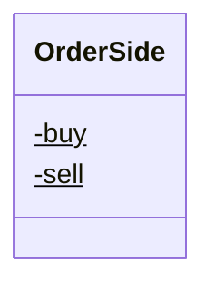

<div id="MessageType-class-diagram"></div>

##### `MessageType` class diagram

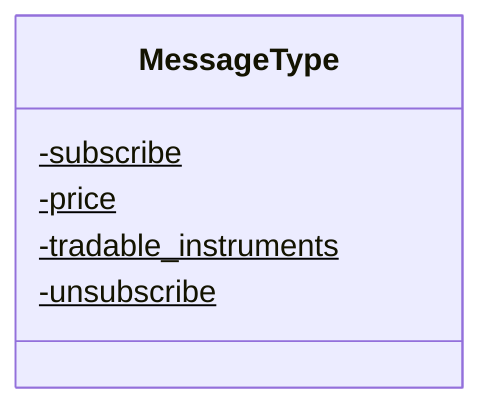

<div id="AccountInfo-class-diagram"></div>

##### `AccountInfo` class diagram

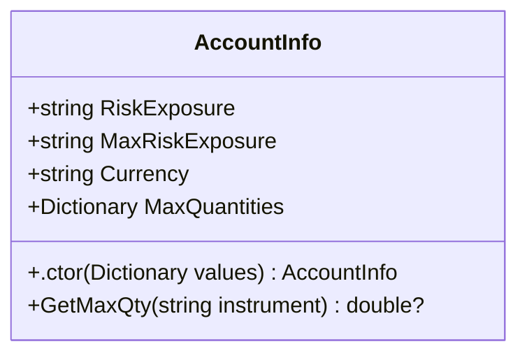

<div id="B2C2Error-class-diagram"></div>

##### `B2C2Error` class diagram

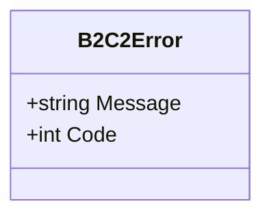

<div id="B2C2Errors-class-diagram"></div>

##### `B2C2Errors` class diagram

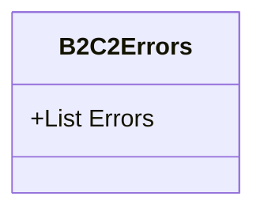

<div id="B2C2Result&lt;T&gt;-class-diagram"></div>

##### `B2C2Result<T>` class diagram

```mermaid
classDiagram
class B2C2Result<T>{
    +bool Success
    +T Result
    +B2C2Errors Error
}

```

<div id="Balances-class-diagram"></div>

##### `Balances` class diagram

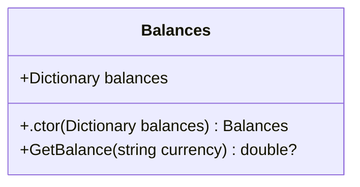

<div id="Currency-class-diagram"></div>

##### `Currency` class diagram

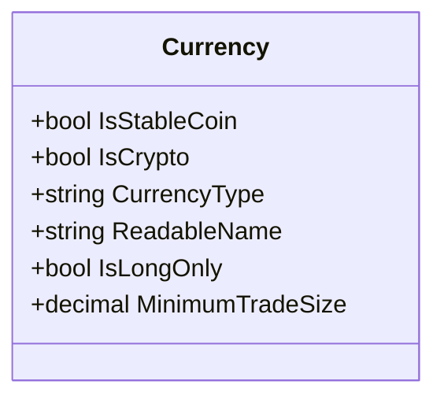

<div id="Instrument-class-diagram"></div>

##### `Instrument` class diagram

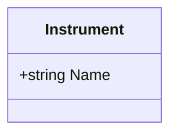

<div id="Order-class-diagram"></div>

##### `Order` class diagram

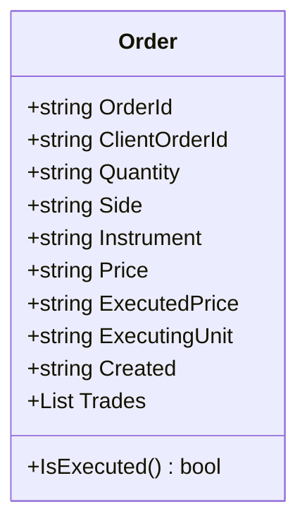

<div id="Trade-class-diagram"></div>

##### `Trade` class diagram

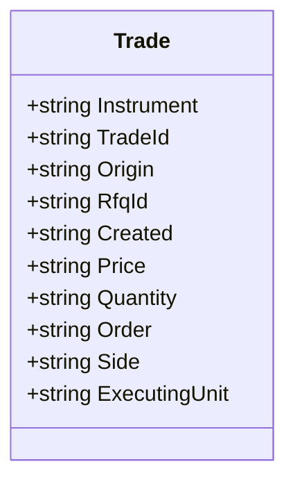

<div id="Level-class-diagram"></div>

##### `Level` class diagram

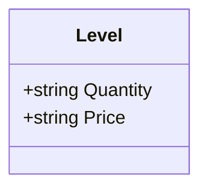

<div id="Levels-class-diagram"></div>

##### `Levels` class diagram

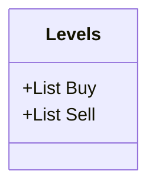

<div id="MarketProfile-class-diagram"></div>

##### `MarketProfile` class diagram

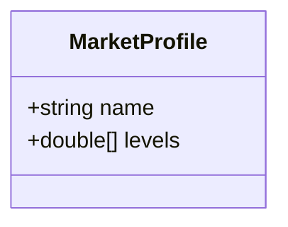

<div id="OrderBookEvent-class-diagram"></div>

##### `OrderBookEvent` class diagram

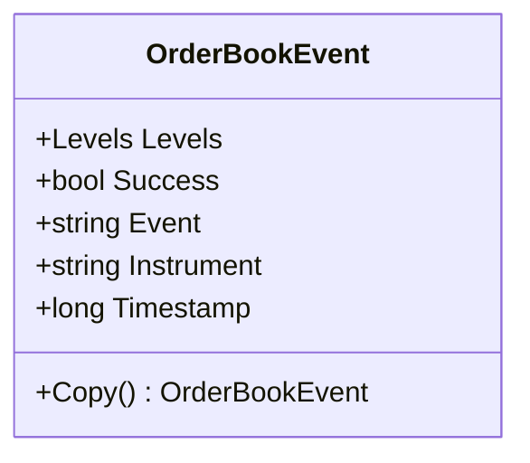

<div id="SubscribeEvent-class-diagram"></div>

##### `SubscribeEvent` class diagram

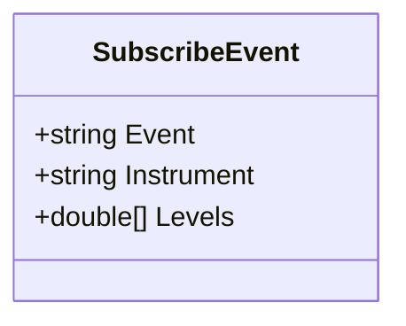

<div id="SubscribeEventResponse-class-diagram"></div>

##### `SubscribeEventResponse` class diagram

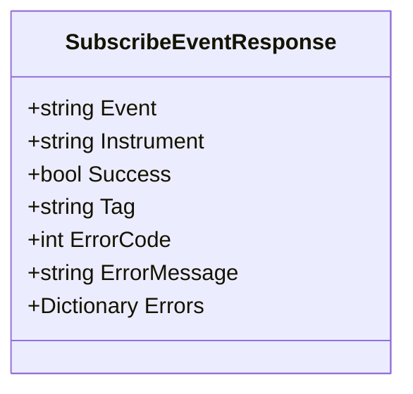

<div id="B2C2RestApi-class-diagram"></div>

##### `B2C2RestApi` class diagram

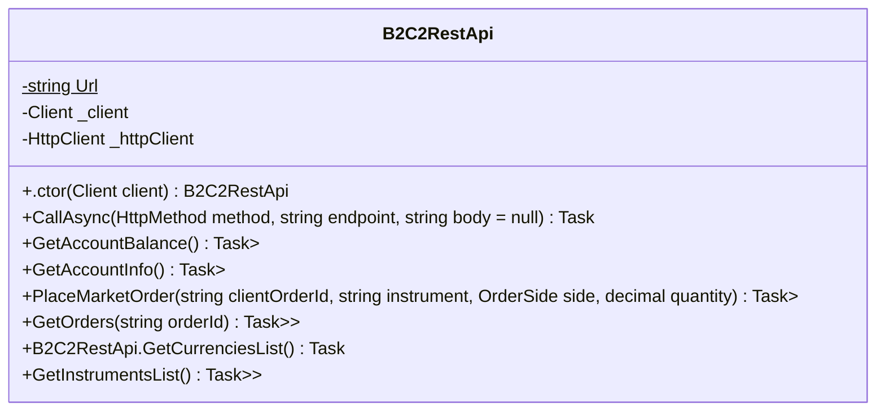

<div id="B2C2RestApiFactory-class-diagram"></div>

##### `B2C2RestApiFactory` class diagram

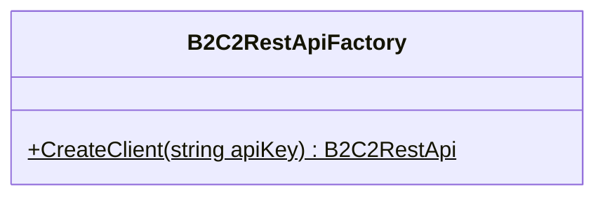

<div id="Client-class-diagram"></div>

##### `Client` class diagram

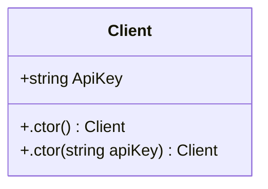

<div id="B2C2Response-class-diagram"></div>

##### `B2C2Response` class diagram

```mermaid
classDiagram
class B2C2Response{
    +bool Success
    +string body
    +.ctor(bool success, string body) B2C2Response
}

```

<div id="B2C2SenderClientWebSocket-class-diagram"></div>

##### `B2C2SenderClientWebSocket` class diagram

```mermaid
classDiagram
class B2C2SenderClientWebSocket{
    +SubscribeChannel(ClientWebSocket webSocket, string instrument, double[] levels)$ Task
    +UnSubscribeChannel(ClientWebSocket webSocket, string instrument)$ Task
}

```

<div id="B2C2WsOrderBooks-class-diagram"></div>

##### `B2C2WsOrderBooks` class diagram

```mermaid
classDiagram
class B2C2WsOrderBooks{
    -Dictionary<string, OrderBookEvent> _data
    -WebsocketEngine _engine
    -ILogger<B2C2WsOrderBooks> _logger
    -IReadOnlyCollection<MarketProfile> _marketList
    -object _sync
    -Func<OrderBookEvent, Task> ReceiveUpdates
    +string Url$
    +.ctor(ILogger<B2C2WsOrderBooks> logger, string authToken, IReadOnlyCollection<MarketProfile> marketList) B2C2WsOrderBooks
    +Dispose() void
    +Start() void
    +Stop() void
    +GetOrderBookById(string id) OrderBookEvent
    +GetOrderBooks() List<OrderBookEvent>
    +Reset(string market, double[] levels) Task
    +Subscribe(string market, double[] levels) Task
    +Unsubscribe(string market) Task
    +Connect(ClientWebSocket webSocket) Task
    +Receive(ClientWebSocket webSocket, string msg) Task
    +OnReceiveUpdates(OrderBookEvent orderBook) Task
}

```

<div id="B2C2WebsocketEngine-class-diagram"></div>

##### `B2C2WebsocketEngine` class diagram

```mermaid
classDiagram
class B2C2WebsocketEngine{
    -string _authToken
    -int _keepAliveInterval
    +.ctor(string name, string url, string authToken, int pingIntervalMSec, int silenceDisconnectIntervalMSec, ILogger logger) B2C2WebsocketEngine
    +InitHeaders(ClientWebSocket clientWebSocket) void
}

```

<div id="Program-class-diagram"></div>

##### `Program` class diagram

```mermaid
classDiagram
class Program{
    -string API_KEY$
    +Main(string[] args)$ Task
    +TestWebSocket()$ Task
    +UseWsOrderBooks(ILoggerFactory loggerFactory)$ Task
    +TestRestApi()$ Task
    +TestErrorsDeserialisation()$ Task
}

```

*This file is maintained by a bot.*

<!-- markdownlint-restore -->
